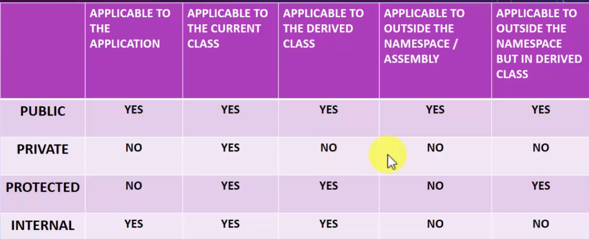

# Public Private Protected

By default private modifiers



Reference add 

right click "access-modifiers2" -> Add -> Projects -> tick "access-modifiers1" -> ok

reference of access-modifiers2 added to access-modifiers1

right click on solution -> single startproject -> select access-modifiers2

## public
```
namespace LearningNeverEnd4
{
    public class class1
    {
        public void show1()
        {
            Console.WriteLine("This is public methods");
        }
    }

    internal class Program1
    {
        static void Main(string[] args)
        {

        }
    }
}
```

```
using LearningNeverEnd4;

namespace access_modifiers2
{
    internal class Program2 : class1
    {
        static void Main(string[] args)
        {
            class1 c1 = new class1();
            c1.show1();

            Program2 p2 =new Program2();
            p2.show1();

            Console.ReadLine();
        }
    }
}
```

## Protected

```
using System;
using System.Collections.Generic;
using System.Linq;
using System.Text;
using System.Threading.Tasks;

namespace LearningNeverEnd4
{
    public class class1
    {
        protected void show1()
        {
            Console.WriteLine("This is Protected methods");
        }
    }

    internal class Program1: class1
    {
        static void Main(string[] args)
        {
            Program1 p1 = new Program1();
            p1.show1();
            Console.ReadLine();
        }
    }
}
```

```
using System;
using System.Collections.Generic;
using System.Linq;
using System.Text;
using System.Threading.Tasks;
using LearningNeverEnd4;

namespace access_modifiers2
{
    internal class Program2 : class1
    {
        static void Main(string[] args)
        {
            //class1 c1 = new class1();
            //c1.show1();

            Program2 p2 =new Program2();
            p2.show1();

            Console.ReadLine();
        }
    }
}
```

## Internal
```
namespace LearningNeverEnd4
{
    public class class1
    {
        internal void show1()
        {
            Console.WriteLine("This is internal methods");
        }
    }

    internal class Program1: class1
    {
        static void Main(string[] args)
        {
            class1 c1 = new class1();
            c1.show1();

            Program1 p1 = new Program1();
            p1.show1();
            Console.ReadLine();
        }
    }
}
```

An assembly is a file that is automatically generated by the compiler upon successful compilation of a .NET application.
