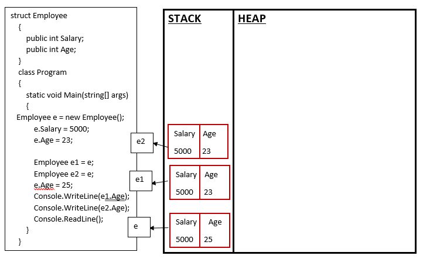
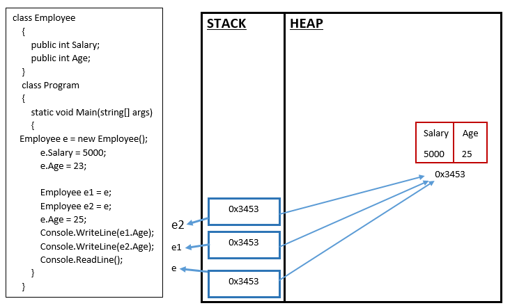

# Value Type Vs Reference Type In C#

## VALUE TYPE:
A data type is a value type if it holds a data value within its own memory space. It means variables of these data types directly contain their values.

The following data types are all of value type:
-	bool
-	byte
-	char
-	decimal
-	double
-	enum
-	float
-	int
-	long
-	sbyte
-	short
-	struct
-	uint
-	ulong
-	ushort

## REFERENCE TYPE:

Unlike value types, a reference type doesn't store its value directly. Instead, it stores the address where the value is being stored. In other words, a reference type contains a pointer to another memory location that holds the data.

The following data types are of reference type:
-	String
-	All arrays, even if their elements are value types
-	Class
-	object
-	Delegates
-	Interface

<b>Difference between value type and reference types ?</b>

<table>
  <tr>
    <th>Value Type</th>
    <th>Reference Type</th>
  </tr>
  <tr>
    <td>They are stored on stack memory</td>
    <td>They are stored on heap memory</td>
  </tr>
  <tr>
    <td>Contains actual value</td>
    <td>Contains reference to a value</td>
  </tr>
    <tr>
    <td>Cannot contain null values. However this can be achieved by nullable types</td>
    <td>Can contain null values.</td>
  </tr>
    <tr>
    <td>Memory is allocated at compile time</td>
    <td>Memory is allocated at run time</td>
  </tr>
  </table>

  <b>Diff bt stack and heap</b>

  <table>
  <tr>
    <th>Stack</th>
    <th>Heap</th>
  </tr>
  <tr>
    <td>Values are stored on one another like a stack.</td>
    <td>Values are stored in random order like dumped into a huge space</td>
  </tr>
  <tr>
    <td>Used for value type</td>
    <td>Used for reference types</td>
  </tr>
  </table>